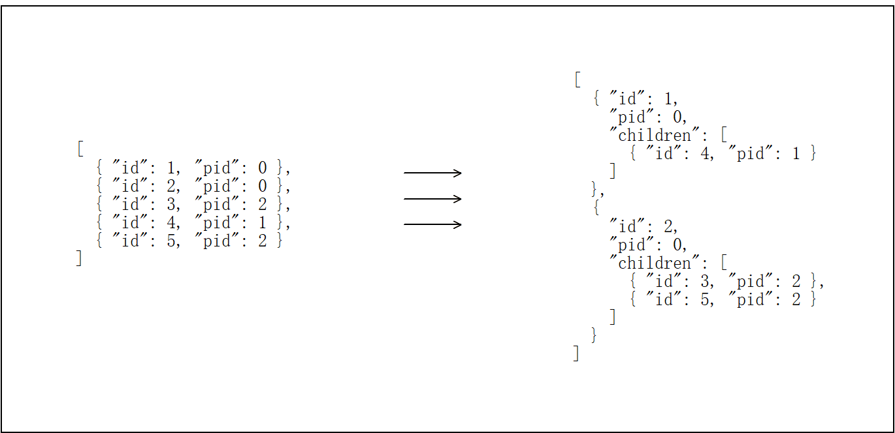

> 特定情况在这里指，单条数据在整个算法中仅需做一次处理  

## 前言

在项目中遇到如下需求，将一条内部有依赖关系的扁平结构数据，转换为树形结构数据，其中属性 pid 对应其父节点的属性 id，属性 children 存放子节点，顶层（一级）pid 为 0



## 常规递归解决

> 首先想到了如下解决方法

```js
function flatToTree(list, id) { // 数据树形化
  // 参数 list 表示原始扁平结构数据
  // 参数 id 用来标识顶层 pid
  const result = []

  for (let i = 0; i < list.length; i++) {
    if (list[i].pid === id) {
      const children = flatToTree(list, list[i].id)
      if (children.length)
        list[i].children = children // 规避无子节点的数据携带不必要的 children 空数组
      result.push(list[i])
    }
  }

  return result
}
```

## 递归次数优化

> 后面觉察到每条数据在遍历中被匹配时，后面的遍历过程中其实已经无需此条数据的参与了，于是想了想做了如下改进

```js
function flatToTree(list, id) { // 数据树形化
  // 参数 list 表示原始扁平结构数据
  // 参数 id 用来标识顶层 pid
  const result = []

  for (let i = 0; i < list.length; i++) {
    if (list[i].pid === id) {
      const temp = { ...list[i] } // 临时变量接收匹配到的数据
      list.splice(i, 1) // 在原数组中删除此条数据
      i-- // 遍历回跳
      const children = flatToTree(list, temp.id)
      if (children.length)
        temp.children = children // 规避无子节点的数据携带不必要的 children 空数组
      result.push(temp)
    }
  }

  return result
}
```

## 递归次数优化的深度测试

> 由于上面的树形结构数据需求至多到二级，且数量并不多，所以为了深入考察优化的可靠性，做了如下测试  

### 测试结果

先看测试结果吧（ 原始数据 10,000 条 ）

- 第一次


- 第二次


- 第三次


### 测试代码

```js
// 测试数据树形化的递归次数优化

// -------------------------------------- 定义相关函数 --------------------------------------

// ---------- 获取随机数
function getRandomInt(min, max) {
  return Math.floor(Math.random() * (max - min + 1)) + min
}

// ---------- 生成原始数据
function getData(intNum = 20, top = 5) {
  // 参数 intNum 表示生成数据的长度
  // 参数 top 表示顶层(一级)的数量
  const data = []
  for (let i = 1; i <= intNum; i++) {
    const item = {
      id: i,
      pid: getRandomInt(1, i - 1) // 规避id与pid相等的情况
    }
    if (i <= top)
      item.pid = 0
    data.push(item)
  }
  return data
}

// ---------- 数据树形化
function flatToTree(list, id, complete = true, num) {
  // 参数 list 表示需要树形化的数据
  // 参数 id 用来标识顶层 pid
  // 参数 complete 表示选择的递归方法
  // 参数 num 表示计数
  const result = []

  if (complete) { // 完整递归
    for (let i = 0; i < list.length; i++) {
      num[0]++ // 计数
      if (list[i].pid === id) {
        const children = flatToTree(list, list[i].id, true, num)
        if (children.length)
          list[i].children = children // 规避无子节点的数据携带不必要的 children 空数组
        result.push(list[i])
      }
    }
  }
  else { // 递归次数优化
    for (let i = 0; i < list.length; i++) {
      num[0]++ // 计数
      if (list[i].pid === id) {
        // ---------- 区别 ----------
        const temp = { ...list[i] }
        list.splice(i, 1)
        i--
        // ----------
        const children = flatToTree(list, temp.id, false, num)
        if (children.length)
          temp.children = children // 规避无子节点的数据携带不必要的 children 空数组
        result.push(temp)
      }
    }
  }

  return result
}

// ---------- 深度提取数组中的对象，扁平罗列，检验树形化后的数据是否完整
function resolveObjectFromArray(arr, res) {
  // 参数 arr 表示树形化数据
  // 参数 res 用来接收扁平化数据
  arr.forEach((item) => {
    if (item.children) {
      res.push({ id: item.id, pid: item.pid })
      resolveObjectFromArray(item.children, res)
    }
    else {
      res.push(item)
    }
  })
}

// ---------- 测试生成
function multiTest(complete = true) {
  // 参数 complete，true of false 完整递归 or 减法递归
  const num = [0] // 递归计数器
  // const data = [...resourceData]
  // 减小影响结果的可能性，生成新的地址存放数据
  const data = []
  resourceData.forEach((item) => {
    data.push({ ...item })
  })

  const timeBefore = +new Date()
  const res = flatToTree(data, 0, complete, num) // 数据树形化
  const timeAfter = +new Date()
  console.log('时间消耗：', (timeAfter - timeBefore) / 1000) // 打印时间差，秒
  // console.log('树形结构数据：', res);
  console.log('次数：', num) // 打印计数器

  const flatRes = [] // 存放检验结果
  resolveObjectFromArray(res, flatRes) // 检验数据完整性
  // console.log('树形结构还原：', flatRes);

}

// --------------------------------------测试开始 --------------------------------------

const resourceData = getData(10_000, 5) // 生成原始数据，这里按 10,000 条数据了来进行测试
console.log('resourceData == ', resourceData)

// 测试开始
console.log('---------------------------------------- 完整递归 ------------------------------------------------')
multiTest() // 完整递归
console.log('---------------------------------------- 递归优化 ------------------------------------------------')
multiTest(false) // 递归优化
```
