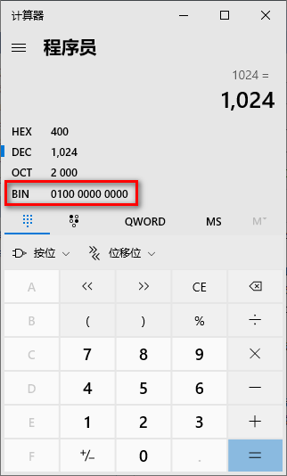

## 计算一个数字为2的多少次方

将十进制转换为二进制，1后面0的个数即为多少次方。
如1024转二进制为 100 0000 0000，即1024为2的10次方：

## 存储器地址线和数据线计算

比如256K×8bit的存储器，
地址线：8(256转换二进制为 1 0000 0000，即为2的8次方) + 10(1024为2的10次方) = 18
数据线：8(后面的8即为数据线)

## 存储器容量计算

依旧按上面的256K×8bit的存储器，
按位计算 (b)： 存储容量 = 存储单元个数 x 存储字长 = 256 * 1024 * 8 = 2097152bit
按字节计算(B)：存储容量 = 存储单元个数 x 存储字长 / 8 = 256 * 1024 * 8/8 = 262144B = 256KB

## 参照
https://zhidao.baidu.com/question/506387686.html
https://blog.csdn.net/Dingjiawang6/article/details/72860759